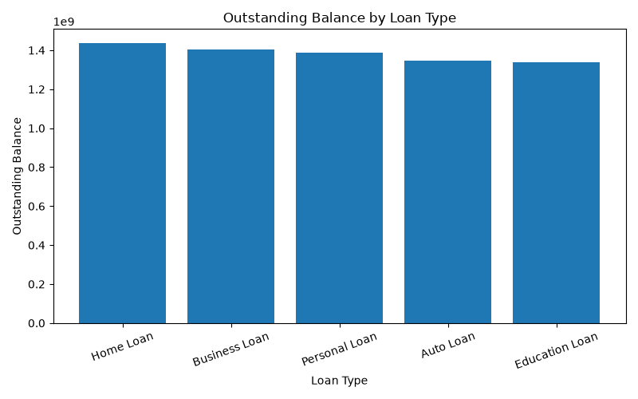
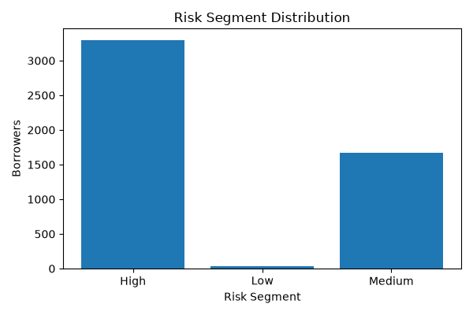
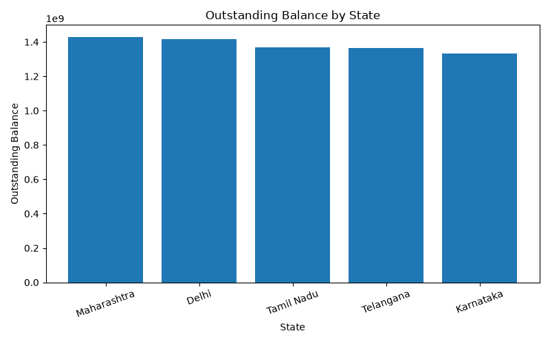
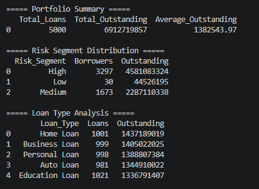
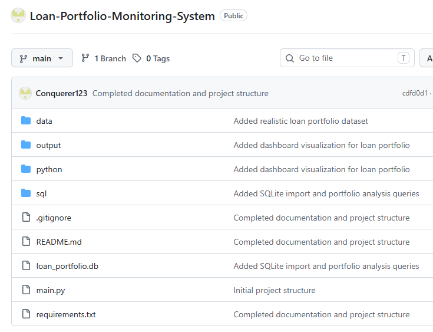

# Loan Portfolio Monitoring & Risk Analysis System

An end-to-end loan portfolio analytics project built using **Python, SQLite, SQL, Pandas, and Matplotlib** to analyze a synthetic portfolio of **5,000 loan accounts**. The project demonstrates portfolio monitoring, DPD-based risk analysis, SQL reporting, and dashboard-ready visualizations.

---

## Project Overview

This project simulates a banking loan portfolio and provides analytical insights into loan performance and outstanding exposure. It combines SQL and Python to automate portfolio analysis and generate reports that can support lending and risk management decisions.

---

## Features

- Generated a synthetic loan portfolio dataset with **5,000 loan accounts**
- Imported data into an **SQLite** database
- Performed portfolio analysis using SQL
- Classified borrowers based on **Days Past Due (DPD)**
- Generated automated analytical reports using Python
- Created dashboard visualizations using Matplotlib

---

## Tech Stack

- Python
- SQLite
- SQL
- Pandas
- Matplotlib
- Git & GitHub

---

## Project Workflow

```text
CSV Dataset (5000 Records)
        │
        ▼
SQLite Database
        │
        ▼
SQL Analysis
        │
        ▼
Python Analytics
        │
        ▼
CSV Reports & Dashboard Charts
```

---

## Folder Structure

```text
Loan-Portfolio-Monitoring-System/

├── data/
│   └── loan_portfolio.csv
│
├── python/
│   ├── generate_dataset.py
│   ├── import_data.py
│   ├── analysis.py
│   └── dashboard.py
│
├── sql/
│   ├── schema.sql
│   └── analysis_queries.sql
│
├── output/
│   ├── reports/
│   └── charts/
│
├── screenshots/
│
├── README.md
├── requirements.txt
├── .gitignore
└── loan_portfolio.db
```

---

## SQL Analysis Performed

- Total Portfolio Exposure
- Average Outstanding Balance
- Risk Segment Distribution
- DPD Bucket Analysis
- Loan Type Analysis
- State-wise Portfolio Exposure
- High-Risk Borrower Identification

---

## Sample Portfolio Summary

| Metric | Value |
|---------|-------|
| Total Loans | 5,000 |
| Total Outstanding | ₹6.91 Billion |
| Average Outstanding | ₹1.38 Million |

---

## Dashboard Preview

### Outstanding Balance by Loan Type



### Risk Segment Distribution



### State-wise Outstanding



### Python Analytics Output



### GitHub Repository



---

## How to Run

1. Clone the repository

```bash
git clone https://github.com/Conquerer123/Loan-Portfolio-Monitoring-System.git
```

2. Install dependencies

```bash
pip install -r requirements.txt
```

3. Generate the dataset

```bash
python python/generate_dataset.py
```

4. Import data into SQLite

```bash
python python/import_data.py
```

5. Run portfolio analytics

```bash
python python/analysis.py
```

6. Generate dashboard charts

```bash
python python/dashboard.py
```

---

## Future Enhancements

- Interactive Power BI Dashboard
- Loan Recovery Analysis
- Predictive Default Risk Model
- Branch Performance Dashboard
- Monthly Portfolio Monitoring

---

## Author

**Karthik Prabhu**